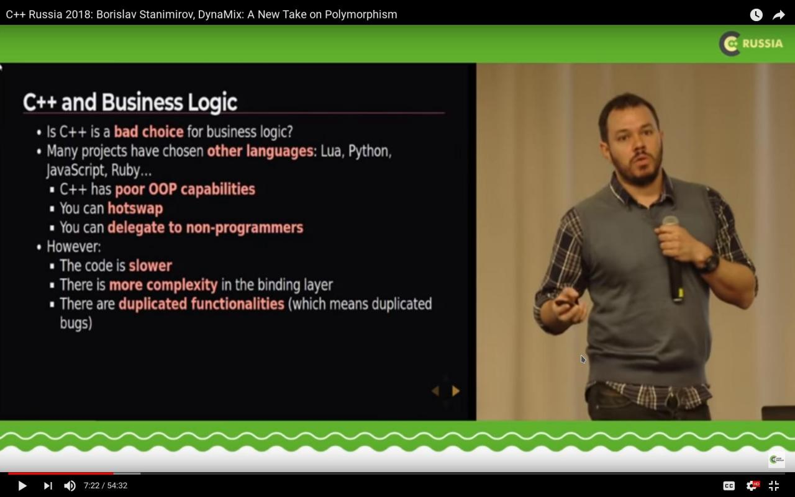

DynaMix
===========

[](https://isocpp.org/) [](https://en.wikipedia.org/wiki/C%2B%2B#Standardization) [](https://opensource.org/licenses/MIT) [](https://gitter.im/iboB/dynamix?utm_source=badge&utm_medium=badge&utm_campaign=pr-badge)

[](https://travis-ci.org/iboB/dynamix) [](https://ci.appveyor.com/project/iboB/dynamix)

[](https://meetingcpp.com/index.php/br/items/a-cpp-review-community.html)

DynaMix (*Dynamic Mixins*) is a new take on polymorphism. It lets the user compose and modify polymorphic objects at run time in C++.

The library is a means to create a project's **architecture** rather than achieve its purpose. It focuses on **maximal performance** and **minimal memory overhead**.

DynaMix is great for the software architecture of systems with very complex objects including, but not limited to:

* Games (especially role-playing ones or strategies)
* CAD systems
* Enterprise systems
* UI libraries

The library uses the type `dynamix::object` as a placeholder, whose
instances can be extended with existing classes (mixins), thus providing
a particular instance with the functionality of all those types. Accessing the
newly formed type's interface is made through messages &ndash; stand-alone functions
generated by the library, which can be thought of as methods.

Here is a small example of what your code may look like if you use the library:

```c++
    // assuming my_objects.get_ally(0); is a way to get an ally to the
    // main character in a game
    dynamix::object& obj = my_objects.get_ally(0);

    // now let's make the object think some positive thoughts about the
    // main character

    think(obj); // C++ doesn't allow us to have obj.think().
                // DynaMix's messages are standalone functions

    // composition
    dynamix::mutate(obj)
        .add<flying_creature>();

    // object can now respond to fly()

    fly(obj); // ...instead of obj.fly()

    // mutation
    dynamix::mutate(obj)
        .remove<ally>()
        .add<enemy>();

    think(obj); // the same object now thinks negative thoughts about the main
                // character, since it's no longer an ally, but an enemy
```

Here are some of the key features of the library:

* Compose objects from mixins at run time
* Physically separate interface and implementation
* Fast polymorphic calls &ndash; comparable to `std::function`
* No external dependencies other than the standard library
* Non-intrusive &ndash; mixins don't need to have a common parent or any special code inside
* Mutate "live" objects by changing their composition at run time
* Have multicast messages, which are handled by many mixins within an object
* Possibility to have custom allocators to finely tune the memory and aim for
cache-locality for critical parts of the code
* Ability to have dynamic libraries that can enrich or modify objects, without
modifying, or even rebuilding, the executable.
* Thread safe message calls &ndash; as thread safe as the underlying methods.

You can also check out [the talk about DynaMix from C++ Russia 2018](https://www.youtube.com/watch?v=-s0zYXGCfJk) or the [article about it in ACCU's Overload Journal from April, 2018](https://accu.org/index.php/journals/2487).

[](https://www.youtube.com/watch?v=-s0zYXGCfJk)

## Created with DynaMix

The following projects are known to use DynaMix as a key piece of their software architecture:

* [War Planet Online: Global Conquest](http://warplanetonline.com/) by Gameloft (Released 2017) - An MMORTS for Android and iOS.
* [Blitz Brigade: Rival Tactics](http://www.rival-tactics.com/) by Gameloft (Released 2017) - A multiplayer RTS for Android, iOS, and Windows.
* [Swords & Crossbones: An Epic Pirate Story](http://store.steampowered.com/app/383720/Swords__Crossbones_An_Epic_Pirate_Story/) by Epic Devs LLC (Released 2014) - A strategy/exploration game for Android, iOS, and PC.
* [Earthrise](https://www.play-earthrise.com/) by Masthead Studios (Released 2011) - An MMORPG (no longer supported). Uses an early proprietary prototype version of the library with a similar interface and a different implementation.

*There are two more known mobile games in development which use it. They will be added to this list upon release.*

## Documentation

The full documentation is available at the [GitHub page of the library](https://ibob.github.io/dynamix/)

### Tutorials

Several small fully working annotated tutorial programs are provided with the library:

* [Basic](https://ibob.github.io/dynamix/basic.html) &ndash; a program which illustrates the basic usage of DynaMix. It's a tutorial on creating mixins and messages, and creating and modifying (or *mutating*) objects.
* [Messages](https://ibob.github.io/dynamix/tutorials.html#messages) &ndash; a tutorial which takes a deeper look at creating and calling the various types of messages.
    * [Message bids](https://ibob.github.io/dynamix/tutorials.html#message_bids) &ndash; a tutorial which takes a deeper look at calling and overriding messages.
* [Mutation](https://ibob.github.io/dynamix/tutorials.html#obj_mutation) &ndash; a tutorial about the various ways by which objects can be created and mutated.
    * [Mutation rules](https://ibob.github.io/dynamix/tutorials.html#mut_rules) &ndash; a deeper look at the library's capabilities for automatic object mutation.
* [Combinators](https://ibob.github.io/dynamix/tutorials.html#mult_combinators) &ndash; a tutorial about handling the return type of multicast messages.
* [Allocators](https://ibob.github.io/dynamix/advanced.html#using_allocators) &ndash; a tutorial about using the library's mixin allocators.
* [Serialization](https://ibob.github.io/dynamix/advanced.html#serializing) &ndash; a tutorial which looks at the possibilities available for serializing objects.

## Building

There is an accompanying `CMakeLists.txt` file in the repo.  Use [CMake](https://cmake.org/) to generate project or make files for your desired platform and compiler.

## Contributing

Contributions in the form of issues and pull requests are welcome.

## License

This software is distributed under the MIT Software License.

See accompanying file LICENSE or copy [here](https://opensource.org/licenses/MIT).

Copyright &copy; 2013-2018 [Borislav Stanimirov](http://github.com/iboB), [Zahary Karadjov](http://github.com/zah)

## Boost.Mixin

DynaMix was initially developed as [Boost.Mixin](https://github.com/iboB/boost.mixin) but is now a separate library, that doesn't depend on the Boost libraries Collection.

DynaMix, unlike Boost.Mixin, has no C++98 support. It's C++11 only.

DynaMix is distributed under the MIT license, whereas Boost.Mixin is distributed under the Boost Software License.

